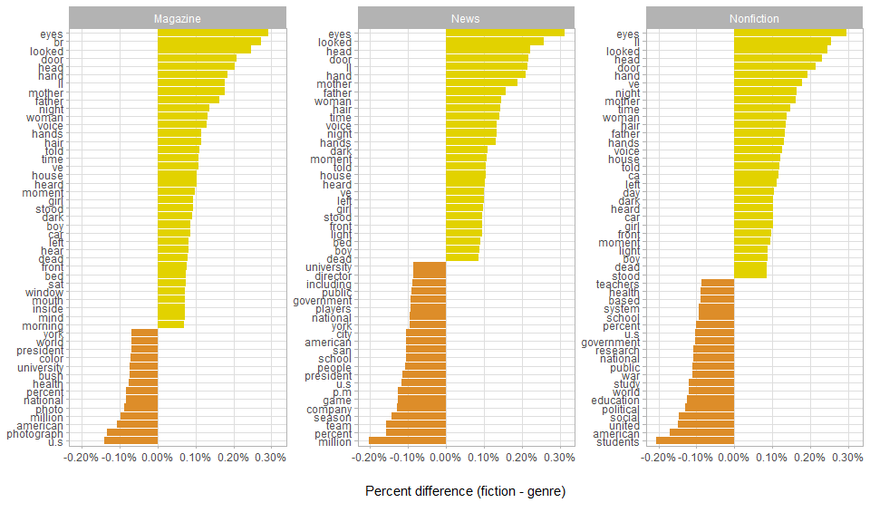

### Which words define fiction?

I’m interested in looking at how the language used in fiction differs
from that of other styles/genres such as nonfiction, magazines, and
news.

There are lots of ways to look at this, but I used data from the Corpus
of Historical American English (COHA) to answer this question. I used
the data from the 2000s.

If you’re interested in the data processing steps, check out the
data_prep.Rmd file. Otherwise, I load in the data I cleaned up and plot
the percent that each of the top 5000 words appears in fiction (on the x
axis) and the percent that each word appears in magazines, news, and
nonfiction on the y axes:

``` r
library(tidyverse)
library(tidytext)
library(wesanderson)

theme_set(theme_light())

word_counts <- read_csv("data/coha_2020_data.csv")

word_counts %>%
    ggplot(aes(fic, value, label = word)) +
    geom_point(alpha = 0.20, color = wes_palette("FantasticFox1")[1]) +
    geom_abline(linetype = "dashed") +
    geom_text(check_overlap = TRUE, size = 3, alpha = 0.80) +
    facet_wrap(~name) +
    scale_x_log10(labels = scales::percent_format(accuracy = 0.001)) +
    scale_y_log10(labels = scales::percent_format(accuracy = 0.001)) +
    coord_equal() +
    labs(x = "Percent occurrence in fiction",
         y = "Percent occurence") +
    theme(panel.grid.minor = element_blank())
```


``` r
ggsave("plots/scatter.png", width = 10, height = 8, units = "in", dpi = 450)
```

The diagonal line shows x = y. Words that fall on, or close to, this
line indicate words that are equally frequent in fiction and the three
other styles/genres. Words that appear well above the line indicate
words that occur much more often in the respective genres. Words that
appear well below the line indicate words that occur more often in
fiction. Not all of the words on the plot are labelled, since that would
be too cluttered, but it gives us a pretty good idea about which words
define fiction as opposed to other genres.

To get a closer look at which words occur most often in fiction relative
to the other genres, and the words that occur most often in the other
genres relative to fiction, I looked the words that occur most/least in
fiction relative to the three other genres:

``` r
word_counts %>%
    mutate(diff = fic - value) %>%
    mutate(abs_diff = abs(diff)) %>%
    group_by(name) %>%
    slice_max(abs_diff, n = 50) %>%
    ungroup() %>%
    mutate(word = reorder_within(word, diff, name)) %>%
    ggplot(aes(diff, word, fill = diff > 0)) +
    geom_col() +
    facet_wrap(~name, scales = "free_y") +
    scale_y_reordered() +
    theme(legend.position = "none",
          panel.grid.minor = element_blank()) +
    scale_x_continuous(labels = scales::percent_format()) +
    labs(x = "Percent difference (fiction - genre)",
         y = NULL) +
    scale_fill_manual(values = wes_palette("FantasticFox1"))
```



``` r
ggsave("plots/bar.png", width = 14, height = 6, units = "in", dpi = 450)
```

The words that define fiction are descriptive words like ‘eyes’ and
‘hands’ as well as verbs like ‘looked’, ‘heard’, and ‘told’. Words that
are defining of the other genres are: ‘U.S.’, ‘American’, ‘million’,
‘president’, and ‘political’ among others. This all makes good sense,
and may seem obvious, but this method is sufficiently generalizable to
work with any bodies of text (e.g., looking at the words that define
certain authors or genres).

This analysis shows that there are some really interesting insights that
can be gained from such simple methods. Here I did nothing more than
count the frequency of words across several genres and present the
results. However, this analysis shows that the language we use is highly
structured, and this structure reveals the structure of different genres
of writing and culture.

<br /> <br /> <br /> <br /> <br />
